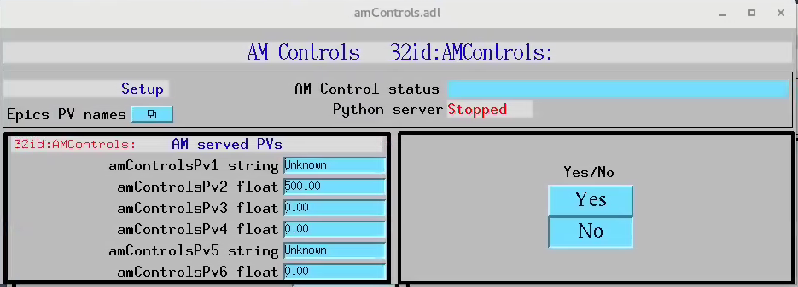

=====
About
=====

**amControls** is an EPICS IOC to demo how to create PVs and support callback in python.

This is a fully functional epics IOC that provide an example on how to create&serve epics PVs, how to connect to PV served by other epics IOCs (both referring to them as PV prefix or full PV name customizable at run time) and how to support a callback via python.

