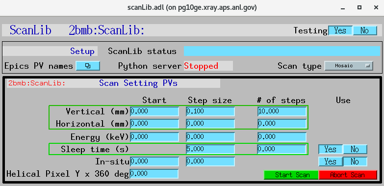
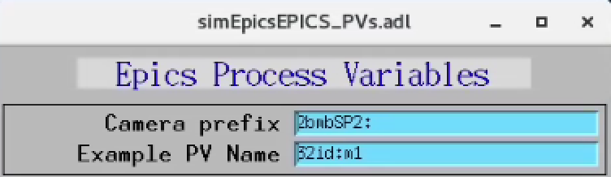

============================
scanLibApp EPICS application
============================

.. 
   toctree::
   :hidden:

   amcntrols.template
   scanlib_settings.req
   scanlib.substitutions

scanLib is an EPICS application, providing scan support to tomoScan. scanLib consisting of:

- A database file and corresponding autosave request file that contain the PVs required by the scanlib.py base class.
- OPI screens for medm
- An example IOC application that can be used to run the above databases.
  The databases are loaded in the IOC with the example substitutions file, 
  :doc:`scanLib.substitutions`.

Base class files
================
The following tables list all of the records in the scanLib.template file.
These records are used by the scanlib base class and so are required.

scanLib.template
----------------

This is the database file that contains only the PVs required by the scanlib.py base class
:doc:`scanLib.template`.

PV Prefixes
-----------

.. cssclass:: table-bordered table-striped table-hover
.. list-table::
  :header-rows: 1
  :widths: 5 5 90

  * - Record name
    - Record type
    - Description
  * - $(P)$(R)TomoscanPVPrefix
    - stringout
    - Contains the prefix for the tomoScan, e.g. 2bmb:TomoScan:

PV names
--------

.. cssclass:: table-bordered table-striped table-hover
.. list-table::
  :header-rows: 1
  :widths: 5 5 90

  * - Record name
    - Record type
    - Description
  * - $(P)$(R)InsituPVName
    - stringout
    - Contains the PV name controlling the in-situ enviroment parameter, e.g. 32id:m1
  * - $(P)$(R)SampleXPVName
    - stringout
    - Contains the PV name for the horizontal motion, e.g. 2bmb:m63
  * - $(P)$(R)SampleYPVName
    - stringout
    - Contains the PV name for the vertical motion, e.g. 2bmb:m25

ScanLib served PVs
^^^^^^^^^^^^^^^^^^

.. cssclass:: table-bordered table-striped table-hover
.. list-table::
  :header-rows: 1
  :widths: 5 5 90

  * - Record name
    - Record type
    - Description
  * - $(P)$(R)VerticalStart
    - stringout
    - Contains a string PV.
  * - $(P)$(R)VerticalStepSize
    - ao
    - Contains a float PV.
  * - $(P)$(R)VerticalSteps
    - ao
    - Contains a float PV.
  * - $(P)$(R)HorizontalStart
    - stringout
    - Contains a string PV.
  * - $(P)$(R)HorizontalStepSize
    - ao
    - Contains a float PV.
  * - $(P)$(R)HorizontalSteps
    - ao
    - Contains a float PV.
  * - $(P)$(R)InsituStart
    - stringout
    - Contains a string PV.
  * - $(P)$(R)InsituStepSize
    - ao
    - Contains a float PV.
  * - $(P)$(R)InsituSteps
    - ao
    - Contains a float PV.
  * - $(P)$(R)EnergyStart
    - stringout
    - Contains a string PV.
  * - $(P)$(R)EnergyStepSize
    - ao
    - Contains a float PV.
  * - $(P)$(R)EnergySteps
    - ao
    - Contains a float PV.
  * - $(P)$(R)PixelsYPer360Deg
    - ao
    - Contains a float PV.
  * - $(P)$(R)SleepTime
    - ao
    - Contains a float PV.
  * - $(P)$(R)YesNoSelect
    - mbbo
    - Contains a float PV.

medm files
----------

scanLib.adl
^^^^^^^^^^^

The following is the MEDM screen :download:`scanLib.adl <../../scanLibApp/op/adl/scanLib.adl>` during a scan. 
The status information is updating.

scanLibEPICS_PVs.adl
^^^^^^^^^^^^^^^^^^^^

The following is the MEDM screen :download:`scanLibEPICS_PVs.adl <../../scanLibApp/op/adl/scanLibEPICS_PVs.adl>`. 

If these PVs are changed scanLib must be restarted.

