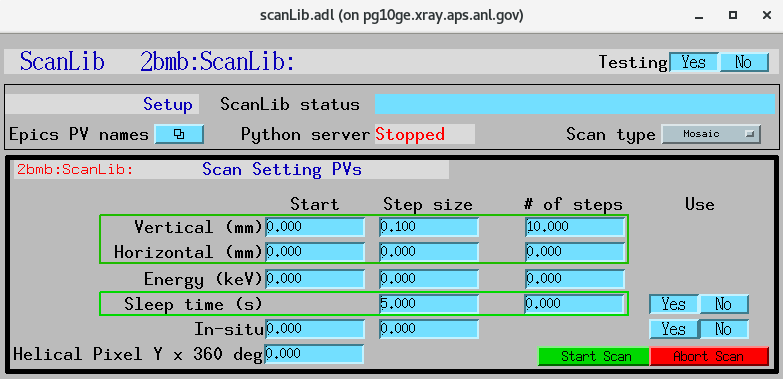

=====
Usage
=====

**scanLib** is a simple EPICS IOC to use as a template for creating EPICS PVs.  **scanLib** also provides callback support examples using python.

Start EPICS IOC
---------------

Edit ~/epics/synApps/support/scanlib/configure to set EPICS_BASE to point to the location of EPICS base, i.e.:

::

    EPICS_BASE=/APSshare/epics/base-3.15.6

then start the **scanLib** epics ioc with:

::

    $ cd ~/epics/synApps/support/scanlib/iocBoot/iocScanLib
    $ start_IOC

Start MEDM screen
-----------------

::

    $ cd ~/epics/synApps/support/scanlib/iocBoot/iocScanLib
    $ start_medm

**scanLib** control screen with no python server running:

.. image:: img/scanLibNoPython.png 
   :width: 720px
   :align: center
   :alt: am_user

Start python server
-------------------

::

    $ bash
    (base) $ conda activate scanlib
    (scanlib) $ cd ~/epics/synApps/support/scanlib/iocBoot/iocScanLib
    (scanlib) $ python -i start_scanlib.py
	configPVS:
	TomoscanPVPrefix : 2bmb:TomoScan:
	InsituPVName : 32id:m1
	YesNoSelect : Yes
	scanLibPv1 : Unknown
	scanLibPv2 : 500.00
	scanLibPv3 : 0
	scanLibPv4 : 0
	scanLibPv5 : Unknown
	scanLibPv6 : 0

	controlPVS:
	Example : None
	ScanLibStatus : divide by 2
	Watchdog : -2265

	pv_prefixes:
	Camera : 2bmbSP2:
	>>>

**scanLib** control screen with python server running:

Testing
-------

...